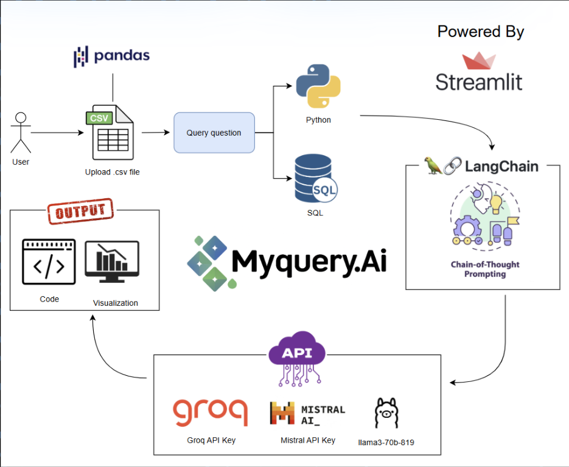

# MyQuery.AI - NLP to Code for Data Analysis

An AI-powered web tool that converts natural language questions into executable Python/SQL code for instant data analysis.

## What it does
- Upload CSV datasets 
- Ask questions in plain English (e.g., "Show me total sales by month")
- Get AI-generated Python/SQL code
- See results as tables or visualizations
- Code explanations for learning

## Tech Stack
- **Frontend**: Streamlit
- **AI Models**: Groq (Llama3-70B), Mistral-Medium
- **Data Processing**: Pandas, duckDB
- **Visualization**: Matplotlib, Seaborn

## 📺 Demo Video

[](https://www.youtube.com/watch?v=dc4CWhvoRv8)


## 🏗️ Architecture



This architecture diagram shows how MyQuery.AI processes your natural language questions into Python/SQL code using AI models.


## Quick Start
1. **Install dependencies:**
   ```bash
   pip install -r requirements.txt
   ```

2. **Set up API keys:**
   - Get free API key from [Groq Console](https://console.groq.com/) and [Mistral](https://console.mistral.ai/build/agents)
   - Create `.env` file, with the following variables:
     ```
      GROQ_API_KEY= groq_key
      MISTRAL_API_KEY= mistral_key
      OPENAI_API_BASE = base_link
     ```

3. **Run the app:**
   ```bash
   streamlit run main.py
   ```

4. **Start analyzing:**
   - Upload your CSV file
   - Ask questions about your data
   - Get instant code and results!

## Example Questions
- "What's the average sales by category?"
- "Show me a trend chart of monthly revenue"
- "Which products have the highest profit margin?"

---
*Built with Streamlit & Groq LLMs*
